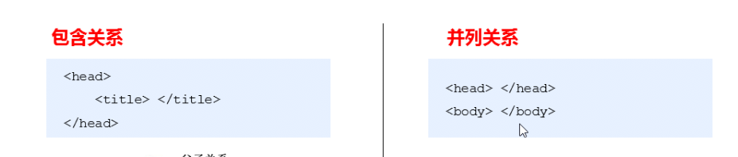
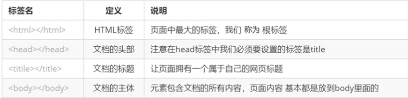
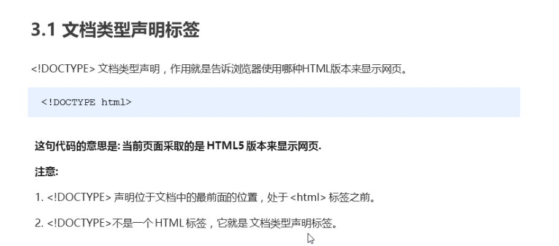
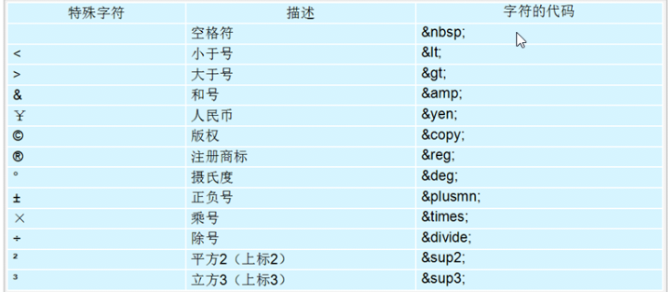

- [1.Html语法规范](#1html语法规范)
- [2.基本结构标签](#2基本结构标签)
- [3](#3)
  - [3.2 lang语言种类](#32-lang语言种类)
  - [3.3 字符集](#33-字符集)
- [4 常用标签](#4-常用标签)
  - [4.1标签的语义](#41标签的语义)
  - [4.2标题标签](#42标题标签)
  - [4.3 段落和换行#](#43-段落和换行)
  - [4.4 文本格式化标签](#44-文本格式化标签)
  - [4.5](#45)
  - [4.6 图像](#46-图像)
  - [4.7 超链接标签](#47-超链接标签)
- [5. 注释和特殊字符](#5-注释和特殊字符)

## 1.Html语法规范

包含关系&并列关系



## 2.基本结构标签





## 3

### 3.2 lang语言种类
en：英语

zh-CN：定义语言为中文

### 3.3 字符集
`<mete charset="utf-8" />'

## 4 常用标签

### 4.1标签的语义

### 4.2标题标签 

`<h1> - <h6>`

标题独占一行

### 4.3 段落和换行# 

</p> 段落标签

<br /> 换行标签(单标签)

### 4.4 文本格式化标签

加粗 `<strong></strong>` or `<b></b>`

倾斜 `<em></em>` or `<i></i>`

删除线 `<del></del>` or `<s></s>`

下划线 `<ins></ins>` or `<u></u>`

### 4.5
`<div>` and `<span>` 没有语义，用来装内容

`<div>` 分割、分区【一个单独占有行】

`<span>` 跨度、跨距 【让一行可以多个`<span>`】

### 4.6 图像
``

src: 必要属性，图片路径

其他图片属性：

alt: 图片显示不出来的时候显示的文本
title：提示文本，鼠标放在图片上显示的文本信息
width：设置图片像素的宽度
height：图片高度
border：图片边框粗细

###  4.7 超链接标签

`<a href="跳转目标" target="目标窗口的弹出方式"> 文本or图像 </a>`

target: Default: _self; __blank在新窗口中打开

href 如果是空的话可以用 "#"代替，代表空连接

href 里面可以放锚点连接,跳转到当前页面的指定位置

```html
<a href="#life"> 个人生活 </a>

<h3 id="life"> 个人生活 </h3>
```

## 5. 注释和特殊字符
以`<!-->`开头`-->`结束 

**特殊字符**



