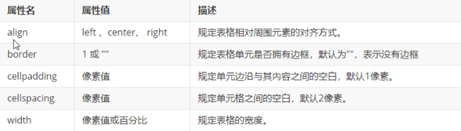
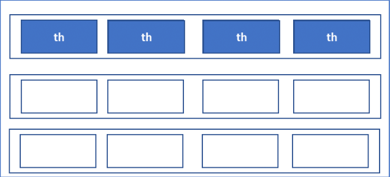
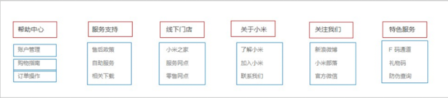
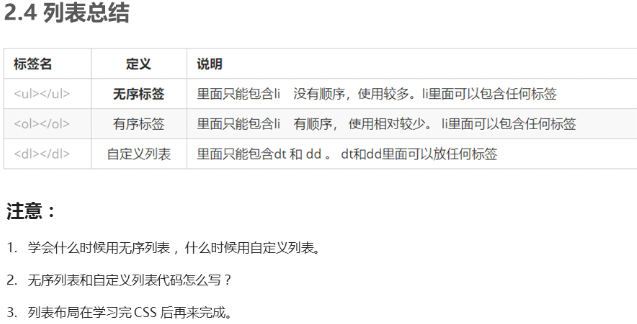

- [表格标签](#表格标签)
  - [表格属性](#表格属性)
  - [表格结构标签](#表格结构标签)
  - [合并单元格](#合并单元格)
- [列表标签](#列表标签)
  - [**无序列表**](#无序列表)
  - [有序列表](#有序列表)
  - [**自定义列表**](#自定义列表)
## 表格标签
```html
<table>
    <tr>
        <th>姓名</th>
    </tr>
    <tr>
        <td>单元格内的文字</td>
        ...
    </tr>
    ...
</table>
```
`<tr>`用于定义表格中的行，必须嵌套在`<tr>`标签中

`<td>`用于定义表格中的单元格，必须嵌套在`<tr></tr>`标签中

字母td指表格数据(table data)，即数据单元格中的内容

`<th>`表头单元格，文字会加粗和居中显示

### 表格属性

一般用css设置



**所有属性放在`<table>`标签中**

### 表格结构标签

表格可以被分成两个部分，一个表头区域`<thead>`，一个内容区域`<tbody>`

主要作用是让表格有更好的语义。可以将表格分割成表格头部和表格主体两大部分。

`<thead>`内部必须要用`<tr>`标签。一般用于表格的第一行

`<tbody>`用于定义表格的主体，主要用于放数据的本体

### 合并单元格

1. 合并单元格方式：
    
    跨行合并: rowspan="合并单元格的个数"

    跨列合并：colspan="合并单元格的个数"
2. 目标单元格

    跨行：最上侧单元格为目标单元格，写合并代码
    
    跨列：最左侧单元格为目标单元格，写合并代码

3. 合并单元格步骤
   1. 先确定是跨行合并还是跨列合并
   2. 找到目标单元格，并写上合并方式 = 合并单元格数量。比如：`<td colspan = "2"></td>`
   3. 删除多余的单元格



## 列表标签

### **无序列表**

```html
<ul>
    <li>列表项1</li>
    <li>列表项2</li>
    <li>列表项3</li>
</ul>
```
**NOTE:**

**`<ul>`里面只能放`<li>`标签**

**`<li>`里面可以放任意标签**

### 有序列表

```html
<ol>
    <li>列表项1</li>
    <li>列表项2</li>
    <li>列表项3</li>
    <li>列表项4</li>
</ol>
```

**NOTE:**

**`<ol>`里面只能放`<li>`标签**

**`<li>`里面可以放任意标签**

### **自定义列表**

> 自定义列表使用场景：
> 
> 自定义列表常用于对术语或专业名词进行解释和描述，定义列表的列表项前没有任何项目符号



```html
<dl>
    <dt>名词1</dt>
    <dd>名词1 解释1</dd>
    <dd>名词1 解释2</dd>
</dl>
```

**NOTE**

1. `<dl>``</dl>`里面只能包含`<dt>`和`<dd>`
2. `<dt>`和`<dd>`个数没有限制，通常是一个`<dt>`对应多个`<dd>`

